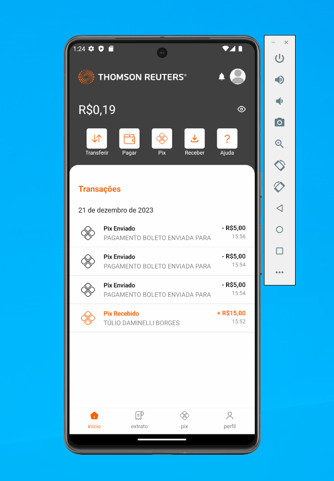
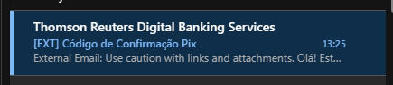
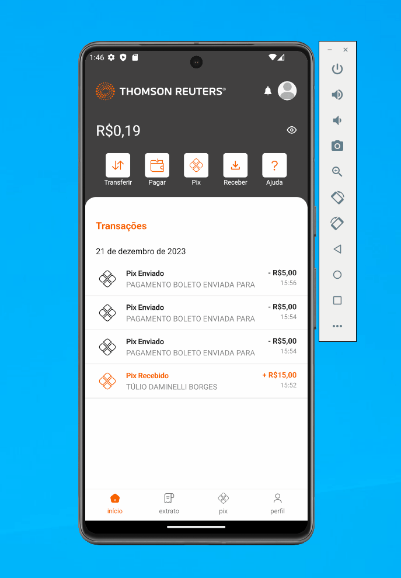
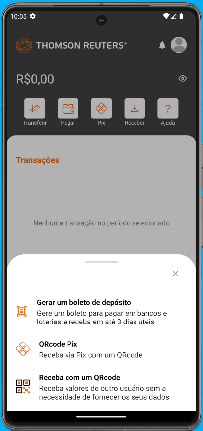

# Sprint 12

## Pagamento de guias de impostos
### App
Não foi possível testar devido a uma falha no pagamento, onde a situação esta sendo tratada na US 596337.

### IBK
Aplica-se a mesma situação em relação ao APP sendo necessário aguardar a US 596337.

## Salvar dados no banco event_dispatcher
Não foi possível validar a implementação visto a existência de erro no pagamento e na emissão de boletos, onde no pagamento o erro ocorre no payload recebido que é inválido, possivelmente devido a um tratamento do JSON no 'AccountTransactionConsumer'.  
Já o erro na emissão dos boletos ocorre devido a uma mensagem solicitando chave PIX, impedindno o seguimento dos testes.

## Botão 'Validar' na criação de chave PIX
Foi realizado testes em relação ao botão 'Validar' existente quando é iniciado o processo de criação de chave pix, porém, não é concluído. 
A funcionalidade no iOS não foi possível testar devido a falha no app do escritório (BUG 601101)

#### Email

#### SMS

## Descrição recebimento via QRcode
Foi testado também a correção da opção 'Receba com um QRcode' onde estava apresentando indevidamente o nome do Bankeiro. 
A correção no iOS não foi possível testar devido a falha no app do escritório (BUG 601101)

