# Sprint 13

## Contas com KYC rejeitado
Foi testado o incidente identificado em relação a criação de contas quando o KYC é inválidado e posteriormente o mesmo passa a ser validado.

#### Status inicial
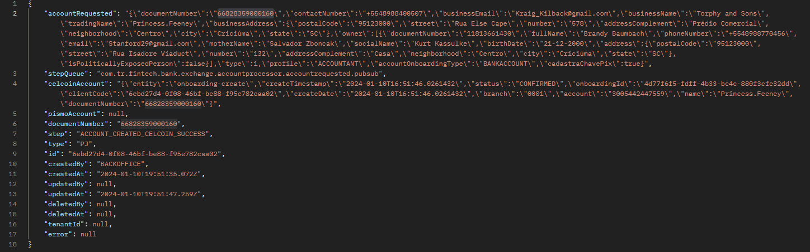

#### Status KYC rejeitado
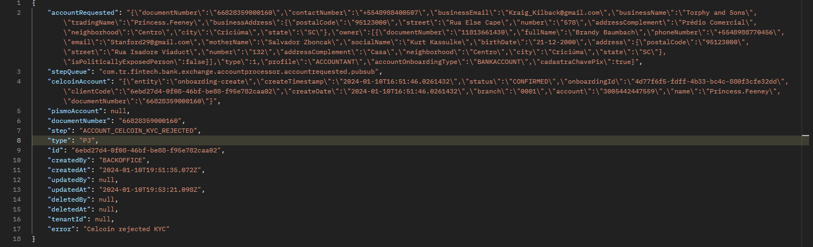

#### Status KYC aprovado
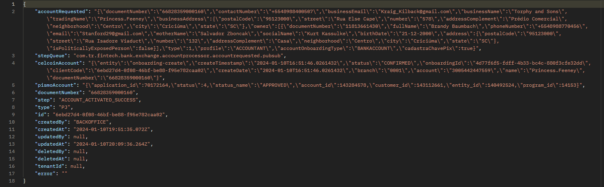

## Botão 'Validar' criação de chave PIX
Foi concluído os testes em relação ao botão 'Validar' disponivel no processo de criação de chave quando esse não é concluído.

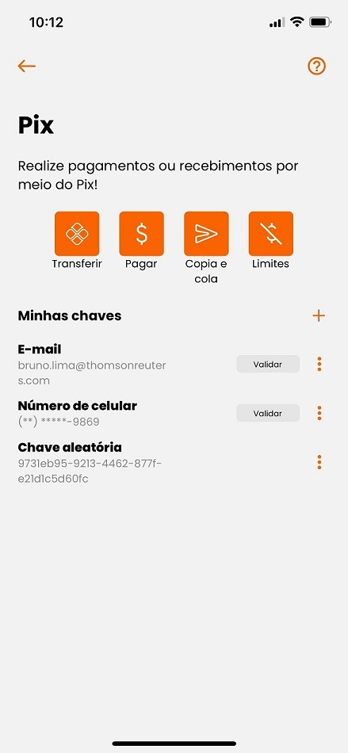

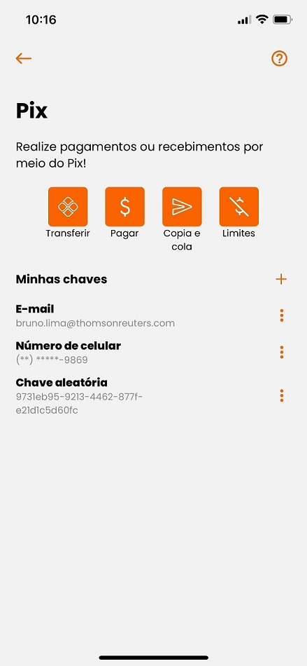

## Ícones incorretos
Foi realizado teste em relação aos icones das transações que não estavam sendo apresentadas. 
Porém, conforme avaliado em refinamento, esta situação pode ser decorrente de cache onde cabe uma Spike para uma melhor avaliação.

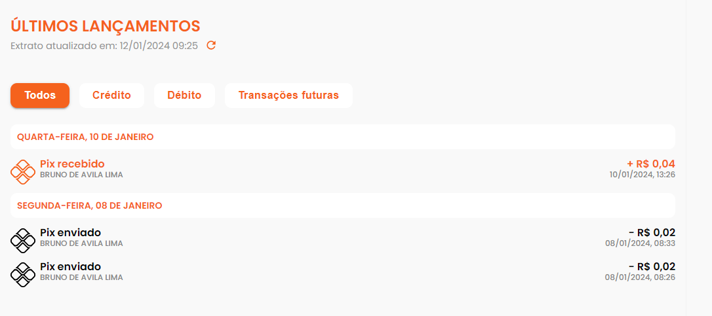

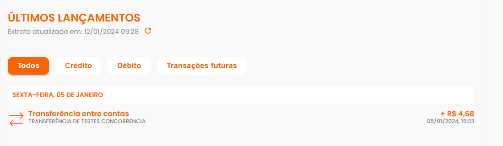

## Criação de contas com erro na Pismo
Teste realizado a partir de uma ocorrência onde foi observado que não está sendo criado conta devidamente apresentando o erro 'Linked_Pismo_Celcoin_Error'. 
Foi realizado teste em ambiente de QA para garantir que a criação de contas se manteve sem falhas.

## Descrição da opção 'Receba com um QRcode'
Foi concluído o teste em relação a correção do texto para recebimento de valores via QRcode, onde estava pendente a validação no iOS.

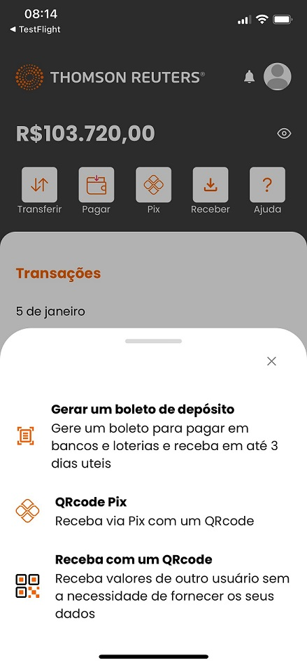

## Garantir que o app iOS esta abrindo
Tivemos um problema em uma das builds que quebrou o app no iOS impossibilitando a abertura do mesmo, onde a situação foi corrigida e o app está ok, conforme pode ser visto pelas imagens dos demais testes feitos no iOS.

## Ocultação botão 'Exportar Extrato'
Validação da implementação que visava esconder o botão 'Exportar Extrato' do IBK. 
Essa alteração foi implementada corretamente, porém, poderá ser apresentada ainda a depender do acesso, devido ao cache.

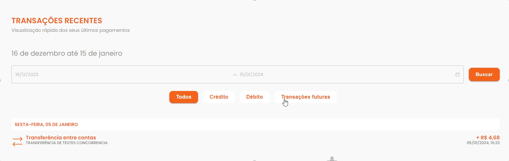

## Correção número telefone perfil do usuário IBK
A correção em questão visava ajustar a apresentação do telefone no perfil do usuário, onde devido o código +55 estava fazendo com que o número fosse apresentado de forma incorreta.

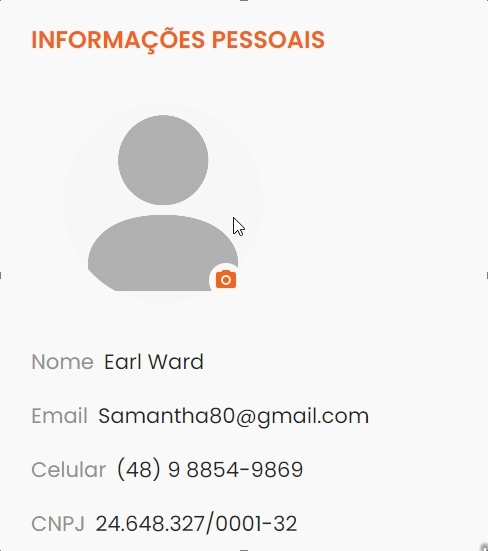

## Criação de conta para contas já existentes na Pismo
Testado a criação de contas para contas já existentes na Pismo, onde estava ocorrendo erro ao criar uma nova conta quando essa já existia na Pismo.

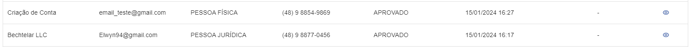