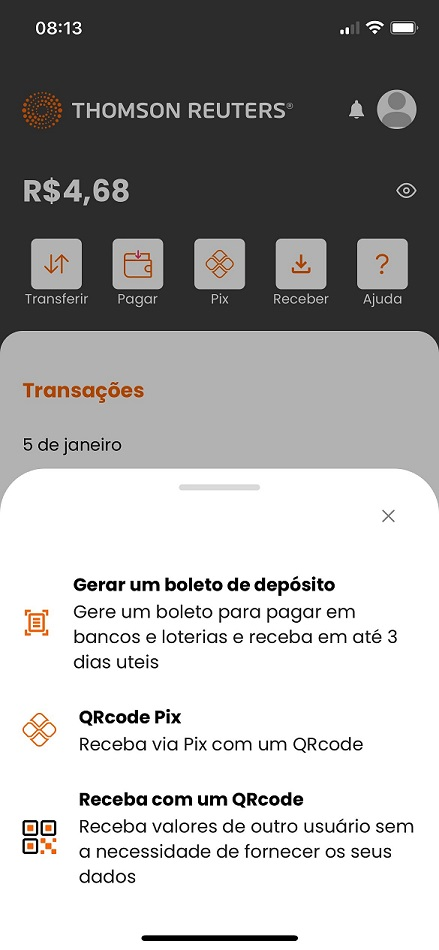

# Sprint 13

## Contas com KYC rejeitado
Foi testado o incidente identificado em relação a criação de contas quando o KYC é inválidado e posteriormente o mesmo passa a ser validado.

#### Status inicial

#### Status KYC rejeitado

#### Status KYC aprovado

## Botão 'Validar' criação de chave PIX
Foi concluído os testes em relação ao botão 'Validar' disponivel no processo de criação de chave quando esse não é concluído.

#### Chave à validar

#### Chave validada

## Ícones incorretos
Foi realizado teste em relação aos icones das transações que não estavam sendo apresentadas. 
Porém, conforme avaliado em refinamento, esta situação pode ser decorrente de cache onde cabe uma Spike para uma melhor avaliação.

#### Ícone do PIX

#### Ícone de Transferência

## Criação de contas com erro na Pismo
Teste realizado a partir de uma ocorrência onde foi observado que não está sendo criado conta devidamente apresentando o erro 'Linked_Pismo_Celcoin_Error'. 
Foi realizado teste em ambiente de QA para garantir que a criação de contas se manteve sem falhas.

## Descrição da opção 'Receba com um QRcode'
Foi concluído o teste em relação a correção do texto para recebimento de valores via QRcode, onde estava pendente a validação no iOS.

## Garantir que o app iOS esta abrindo
Tivemos um problema em uma das builds que quebrou o app no iOS impossibilitando a abertura do mesmo, onde a situação foi corrigida e o app está ok, conforme pode ser visto pelas imagens dos demais testes feitos no iOS.

## Ocultação botão 'Exportar Extrato'
Validação da implementação que visava esconder o botão 'Exportar Extrato' do IBK. 
Essa alteração foi implementada corretamente, porém, poderá ser apresentada ainda a depender do acesso, devido ao cache.

## Correção número telefone perfil do usuário IBK
A correção em questão visava ajustar a apresentação do telefone no perfil do usuário, onde devido o código +55 estava fazendo com que o número fosse apresentado de forma incorreta.

## Criação de conta para contas já existentes na Pismo
Testado a criação de contas para contas já existentes na Pismo, onde estava ocorrendo erro ao criar uma nova conta quando essa já existia na Pismo.

## Limite de caracteres para nome da empresa
Testada a implementação que visa limitar a quantidade de caracteres para o nome da emrpesa na criação da conta na Pismo, onde deverá ser considerado o limite de 60 caracteres.

## Gravar eventos no banco de dados
Foi testado a implementação/correção da US que visava implementar a gravação dos dados de emissão/pagamento de boletos do bankslip.

## Tela de login indevida
Os app apresentavam a tela de login com loading infinito em algumas situações, como no fluxo P2P, Pagamento de Contas.

Essa US gerou retorno, pois foi possível gerar a tela de login em outras situações.

## Internal Server na transferência PIX
Ao realizar uma transferência PIX estava sendo realizada uma requisição para o endpoint pix-transfer-return-reasons que retornava 500, porém, se tratava de uma requisição indevida neste momento.

## Correção do campo Nickname
Ao confirmar os dados para transferência PIX estava sendo apresentado o campo 'Nickname', sendo o correto apresentar 'Apelido do Contato'.

## Bloqueio de pagamento de guia iniciada em 81/85
Foi reimplementado o bloqueio no FE para impedir o pagamento de guias de impostos iniciados em 81/85
#### Guia iniciada em 81

#### Guia iniciada em 85

#### Guia com inicio diferente de 81/85

## Descrição das trasferências P2P no IBK
Foi realizado testes em relação ao tratamento da descrição da movimentação de transferências P2P no IBK para que fossem apresentadas como 'Transferência enviada' e 'Transferência recebida'.

#### Transferência enviada

#### Transferência recebida
