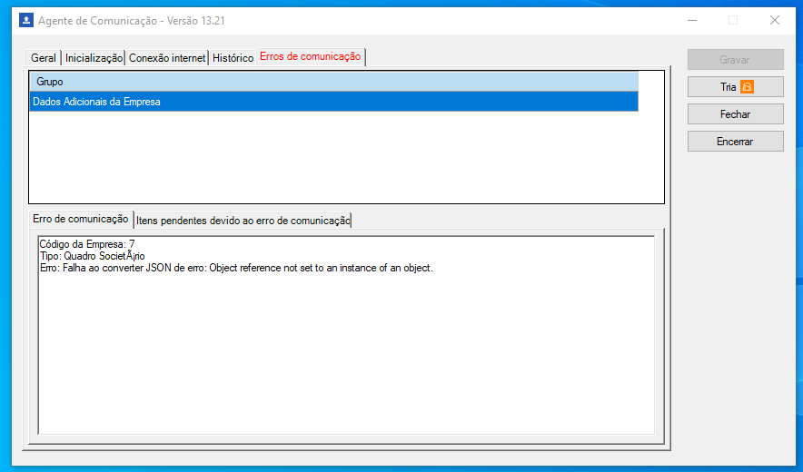

# Sprint 14

## Falha ao postar mensagem é tratado como lido
Foi testado a correção de uma falha que possuímos onde em casos onde ocorria erro na leitura da mensagem postada no webhook o sistema tratava como lido indevidamente. 
Com a correção, o step somente é atualizado após a leitura efetiva da mensagem.

#### Erro no KYC

#### Step sem atualização

#### Conta criada

## Envio do quadro societário para o Onvio
Teste realizado quanto a implementação que trata o envio do quadro societário na ausência do campo 'nationalIdentity'. 
Vale ressaltar que esta situação só foi reproduzida manipulando o JSON, visto que mesmo o campo não havendo informação o sistema envia uma string vazia e o erro ocorre apenas na ausência do campo. 

#### Erro no Agente

#### Reenvio da informação
