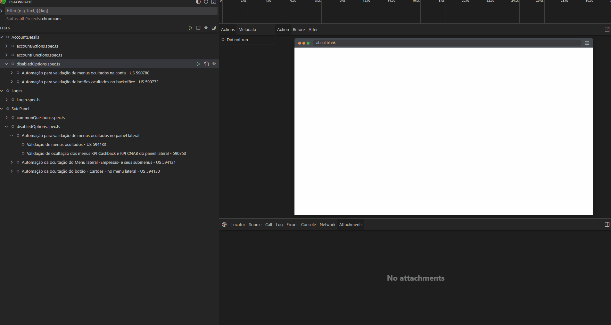
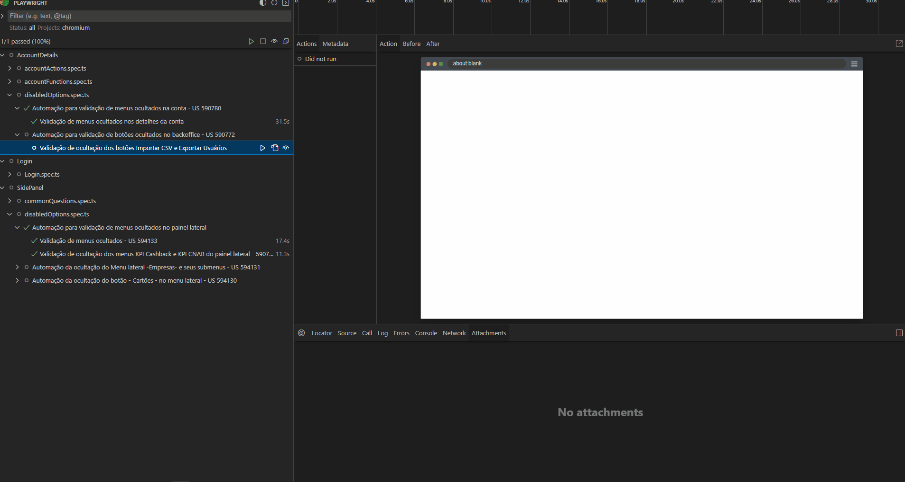
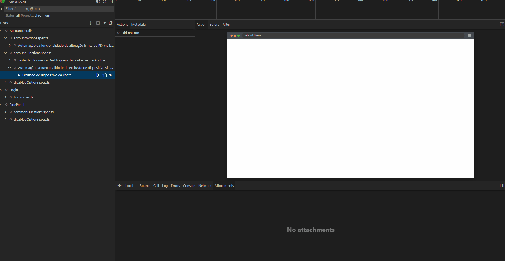
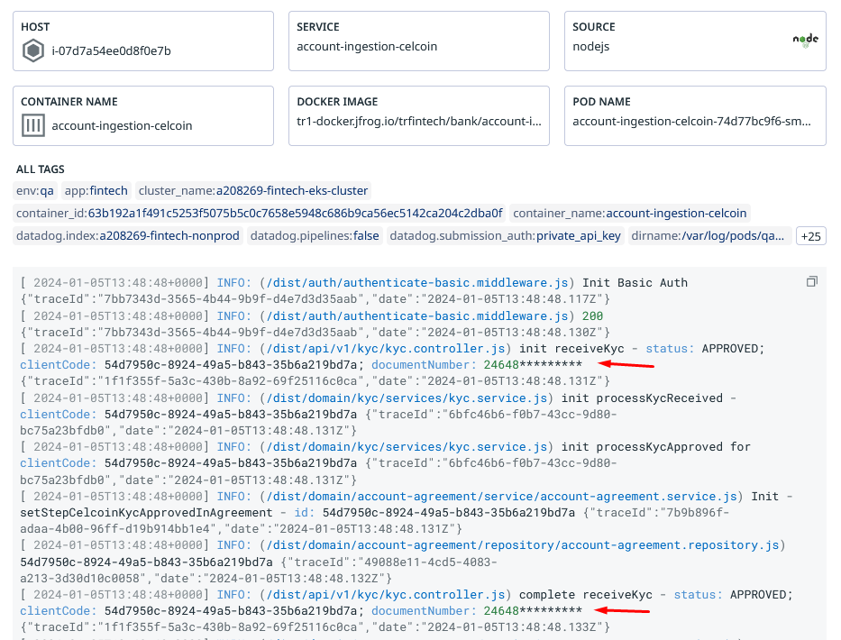
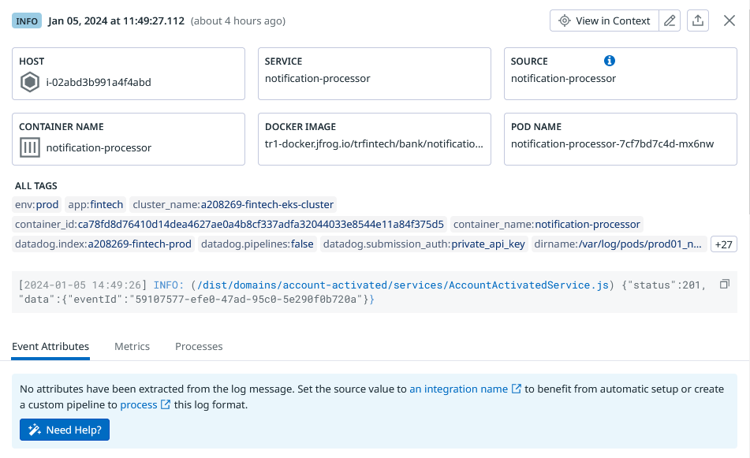

# Sprint 12

## Menus e opções ocultadas
### Menus do Backoffice
Foi testado e implementada automação que validou os menus que passaram a ficar ocultos no backoffice.

### Opções de importações
Foi testado e automatizado também a validação das opções de importações que passaram a ficar ocultas em relatório de contas.

### Opções dentro de contas
Foi testado e automatizado também a validação das opções que passaram a ficar ocultas dentro de contas.

## Automação exclusão de device
Foi implementada automação que realiza a exclusão de device associado a conta via backoffice.

## Ofuscação de dados em log
Foi realizado testes em relação as US que tratavam de ofuscar dados no Log.

Houve testes também em relação a ativação da conta. Esta mesma US contemplava a transações bancárias, porém, não foi possível testar o fluxo completo devido a existência de um erro nas trasações, impedindo que o log apresente o payload.

