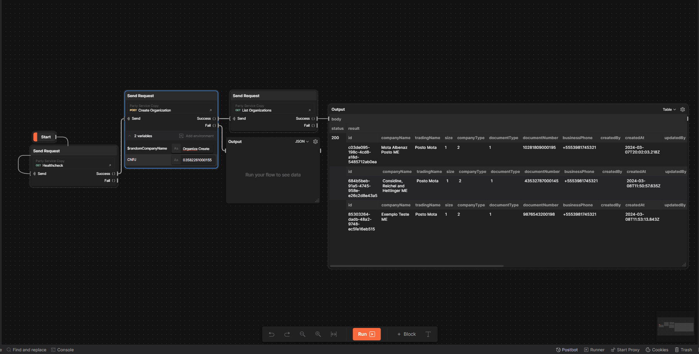
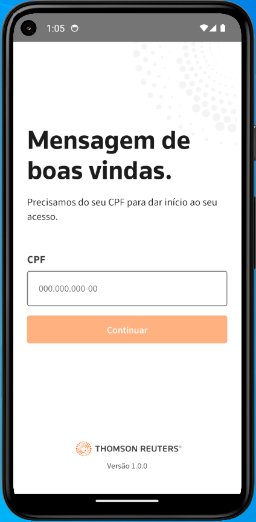
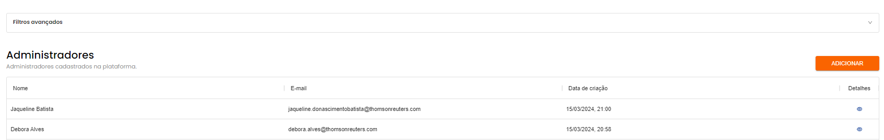

# Sprint 17s

## Party Service
### Create Organization
Foi realizado testes na implementação do endpoint que visa permitir o cadastro de Organization no party-service.

### List Organization
Foi realizado testes na implementação do endpoint que visa permitir listar cadastro de Organization existentes no banco de dados party-service.

## Font Padrão
Foi realizado teste em relação a implementação da font padrão utilizada pela TR. 

## Refatoração Automação IBK
Foi feita a base da refatoração da automação do IBK adotando uma nova estrutura e novo sistema de trabalho, o qual foi apresentado para os demais QA's de forma a permitir que todos atuem no projeto quando houver menos tempo alocado na sprint.

Link: [Apresentação](https://trten-my.sharepoint.com/:v:/g/personal/bruno_lima_thomsonreuters_com/EYVb4Wyn8KZFnF8y7AChVGIBUCEgGUXqpdA6PfqlOqG6Ag?referrer=Teams.TEAMS-ELECTRON&referrerScenario=MeetingChicletGetLink.view.view)

## Cadastro de Administradores Backoffice
Para está implementação os testes não foram realizados diretamente por mim, dada a limitação de permissão para acessar o backoffice, no entanto, participei da reunião de definição do passo a passo do deploy, bem como acompanhei os testes feito pelo Roberto após Deploy.

