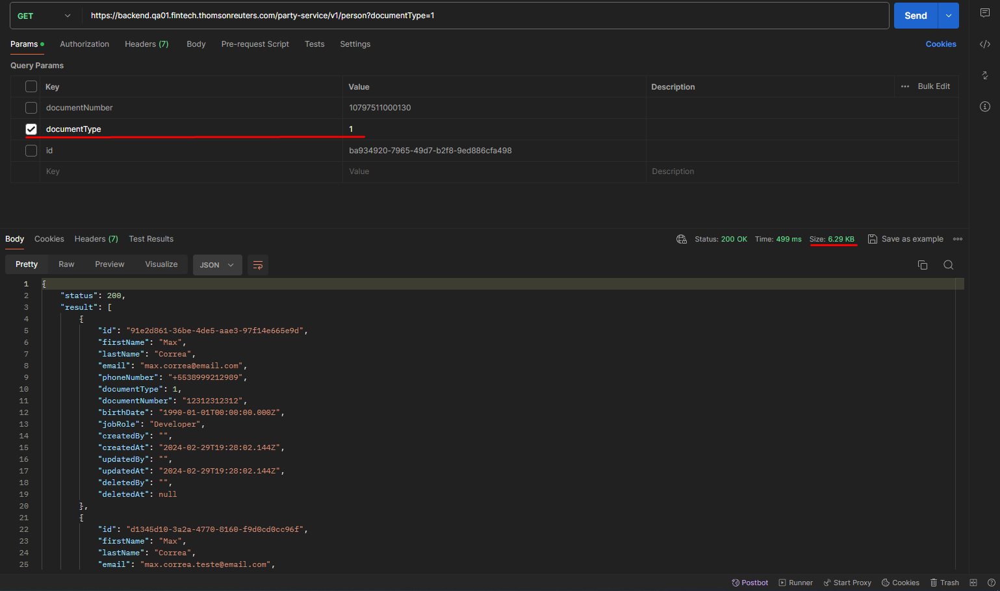
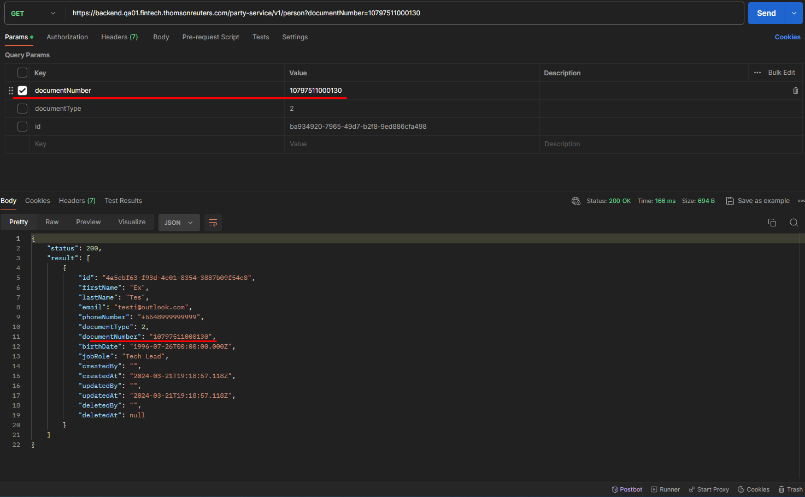
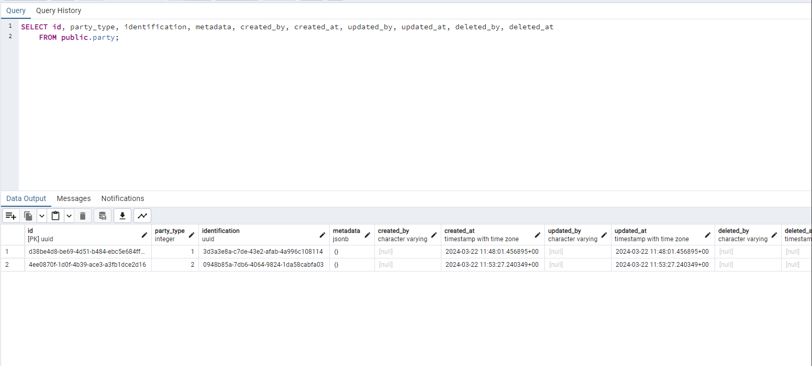
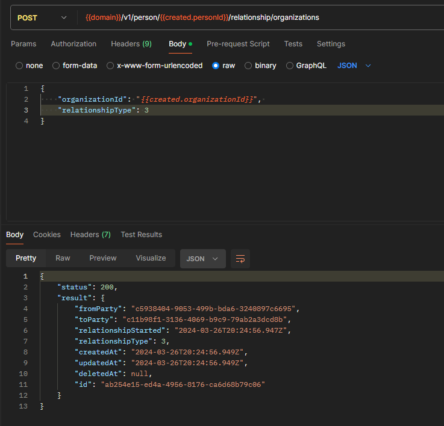
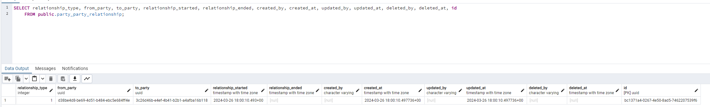

# Sprint 18s

## Refatoração IBK
Foi iniciado o processo de refatoração da automação do IBK, atuando inicialmente na correção de seletores que envolvem a página de PIX, bem como na correção das funções também do PIX, seletores do painel lateral, além de apoio e contextualização da refatoração à colegas.

## Party Service
### Filtro de documentType e documentNumber no endpoint /person
Foi testado a implementação dos filtros de documentType e documentNumber no endpoint de person, de forma a permitir a consulta de forma mais especifica.

#### Document Type

#### Document Number

### Criação da Party
Testada a implementação que visa a criação da party na requisição de create person/organization.

### Criação do relationship
Foi realizado o teste que visava validar a implementação do endpoint '/person/:personId/relationship/organizations', que possui como finalidade criar o relacionamento entre Person e Organization.

#### Criação do relacionamento

#### Relacionamento no banco de dados
