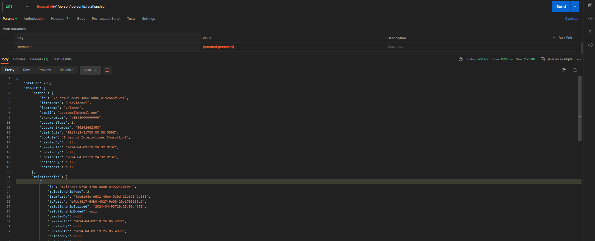
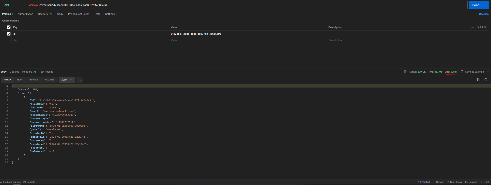
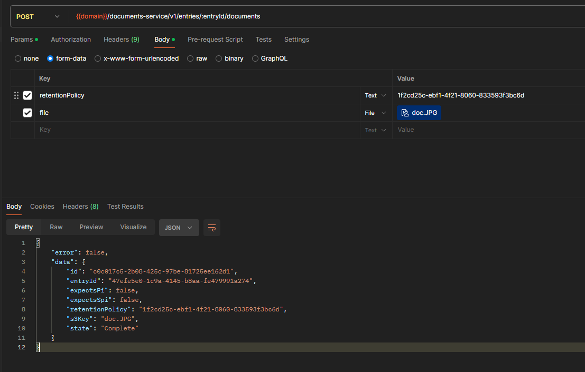
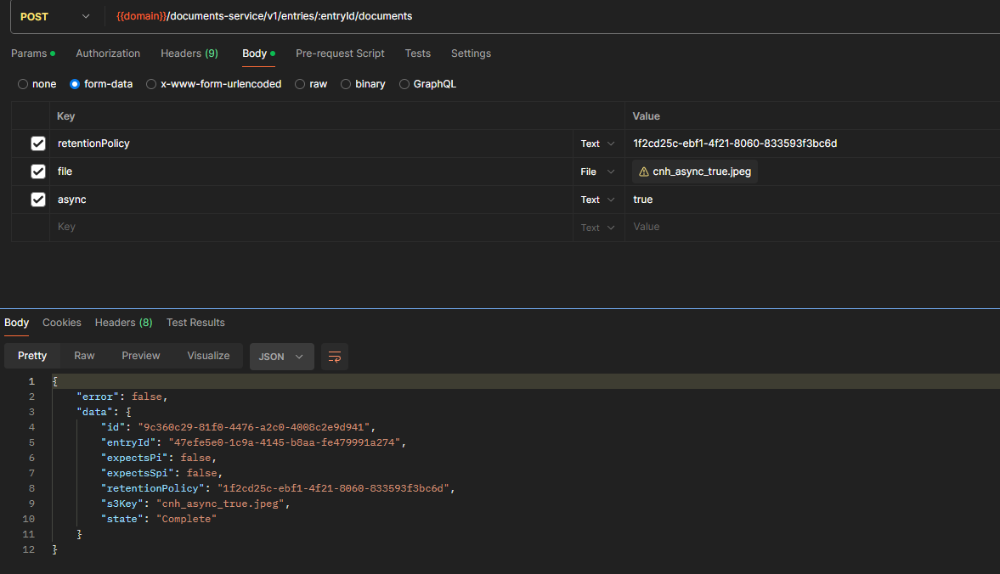
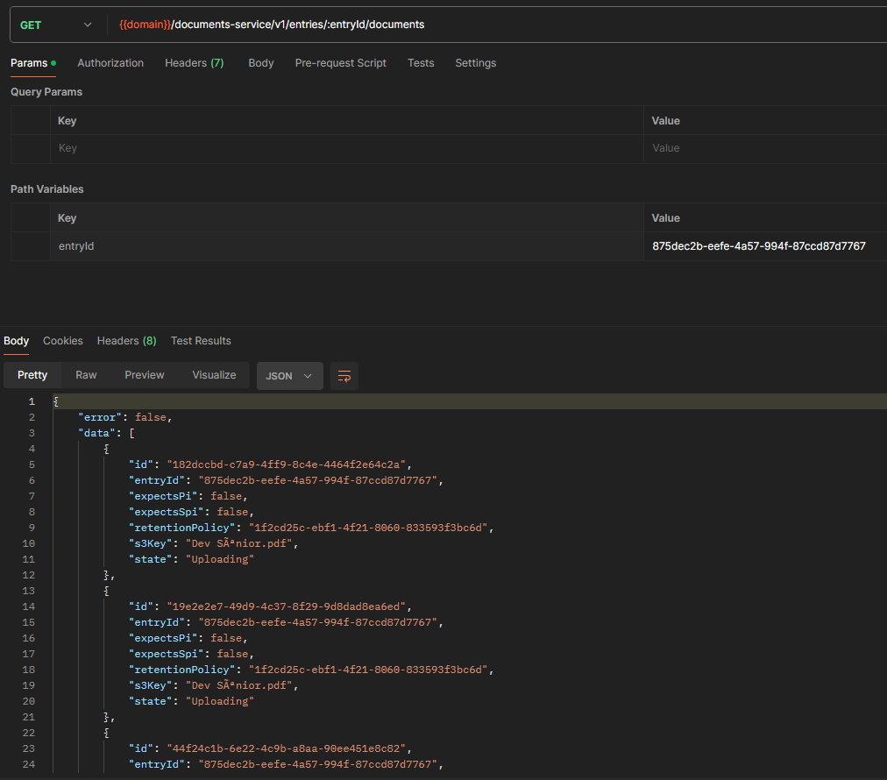

# Sprint 19s

## Party Service
### GET /person/:personId/relationship
Foi realizado teste quanto a implementação do endpoint /person/:personId/relationship que tem como finalidade possibilitar a consulta dos relacionamentos existentes para um determinado person. 

### Filtro por ID no /person
Foi realizado a validação quanto a implementação do filtro por ID no endpoint /person 

## Documents Service
### Upload de Arquivo
Na US foram implementados dois endpoints, sendo o endpoint entry e o de upload sincrono que visa o envio de documentos para o bucket S3, posteriormente houve também a implementação do upload assincrono. Vale ressaltar que entre uma implementação e outra, houve uma alteração de escopo, onde ficou definido que a função sincrona ou assincrona seria definida a partir da flag 'async'. 

#### Upload Sync

#### Upload Async

### Listagem de documentos
Testado a implementação quanto a listagem de documentos armazenados. 

### Download de documentos
Teste quanto a implementação do endpoint para download do documentos armazenados. 

