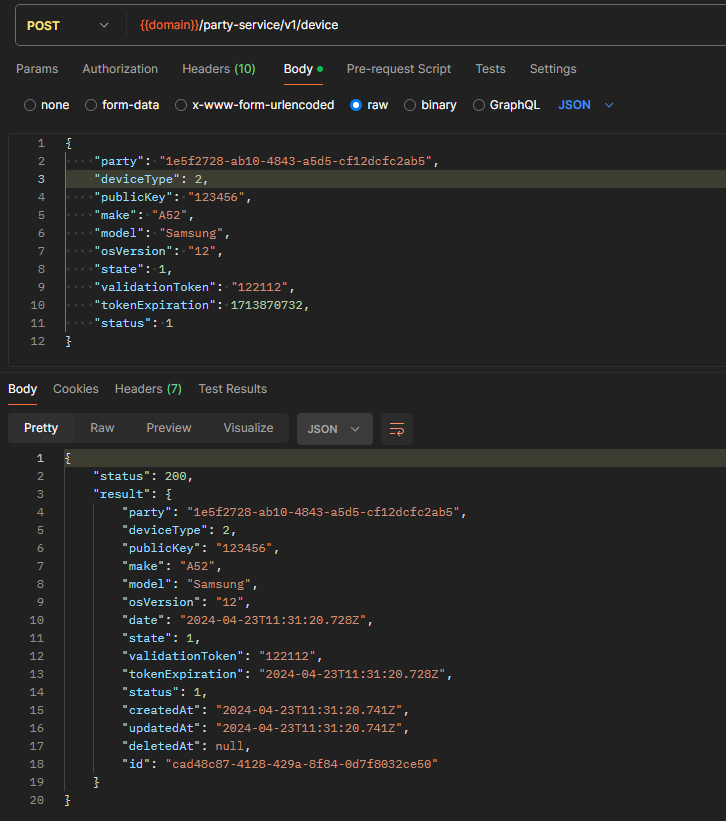
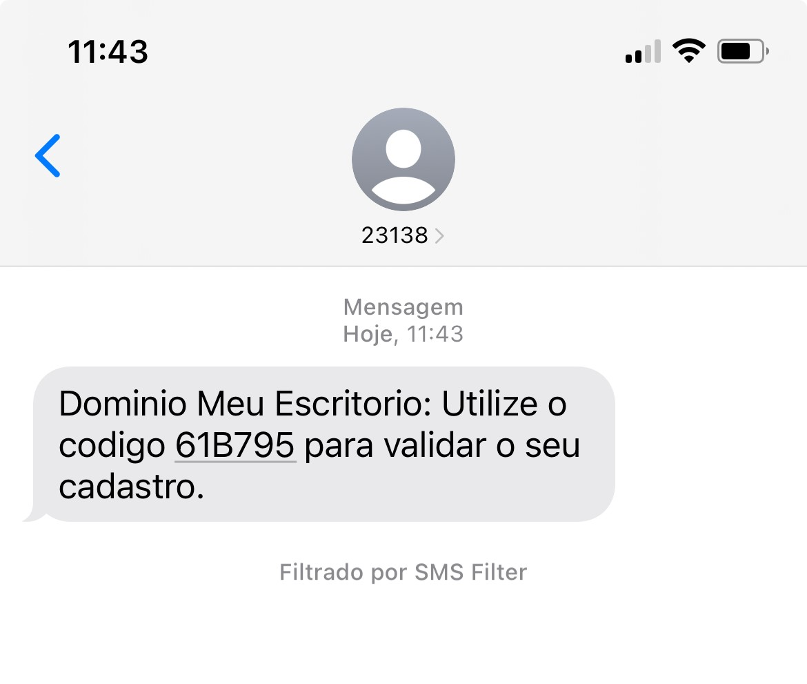
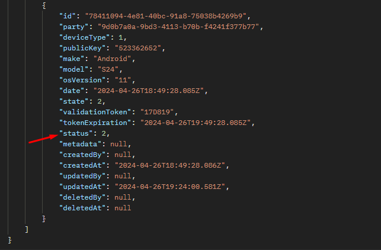

# Sprint 20s

### Validação de CPF
Foi realizado teste em relação a implementação do endpoint que tem como finalidade realizar a validação do CPF de forma a garantir a existência do pré-cadastro. A respectiva implementação ocorreu nos três serviços Meu Escritório, Minha Empresa e Empregado. 
*Ref*.: [US_630738](https://dev.azure.com/tr-ggo/TR%20Fintech/_workitems/edit/630738)

### Correção de validações no endpoint de Download de arquivo
Na sprint passada durante os testes no endpoint de download de arquivo foi identificado a necessidade de algumas melhorias em relação as validações de ID, o qual foram implementadas nesta sprint. 
*Ref*.: [US_630580](https://dev.azure.com/tr-ggo/TR%20Fintech/_workitems/edit/630580)

### Registro de Device
Testada a implementação que visa criar o registro de device para controle de permissão/acesso. 
*Ref*.: [US_629946](https://dev.azure.com/tr-ggo/TR%20Fintech/_workitems/edit/629946)

### Endpoint para envio de Token
Testada a implementação que visa o envio do SMS para autenticação no acesso. Escopo da US redefinido durante a sprint para atender apenas o 'Meu Escritório' e o envio de SMS. 
*Ref*.: [US_623169](https://dev.azure.com/tr-ggo/TR%20Fintech/_workitems/edit/623169)

### Endpoint para validação de Token
Foi realizado testes quanto ao endpoint que visa validar o endpoint disparado ao usuário. A US também teve seu escopo reajustado durante a sprint, contemplando apenas o 'Meu Escritório'. 
*Ref*.: [US_627749](https://dev.azure.com/tr-ggo/TR%20Fintech/_workitems/edit/627749)

## Correções e Segurança
### Correção do Mock para conta de prod
Foi realizado a correção dos Mocks das contas de prod. A partir desta correção, o disparo de SMS/Email deixou de ocorrer, no entanto, conforme validado em conjunto ao Bruno Tavares e Roberto, os logins ocorreram corretamente. 
*Ref*.: [US_630979](https://dev.azure.com/tr-ggo/TR%20Fintech/_workitems/edit/630979)

### Correção de segurança Prototype Pollution
Essa correção impactava o keycloak que por sua vez poderia gerar erros nos logins, desta forma foi realizado testes de logins no IBK, Backoffice, APPs, bem como validado as informações geradas pelo token JWT. 
*Ref*.: [US_621933](https://dev.azure.com/tr-ggo/TR%20Fintech/_workitems/edit/621933)

