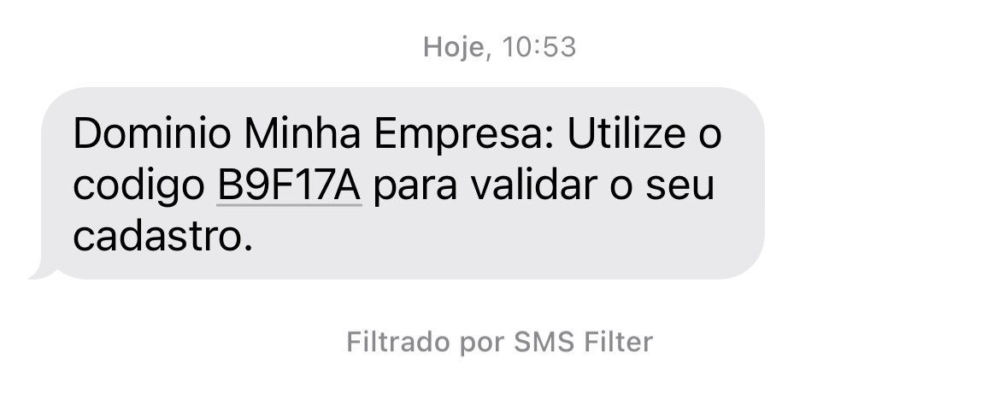

# Sprint 21s

### Envio de Token - Meu Escritório
Realização de teste em relação ao endpoint que visa o envio de e-mail para autenticação de device, para o meu escritório. 
*Ref*.: [US_635446](https://dev.azure.com/tr-ggo/TR%20Fintech/_workitems/edit/635446)

### Registro de Senha - Meu Escritório
Testada a implementação que realiza o registro da senha do usuário. 
*Ref*.: [US_623185](https://dev.azure.com/tr-ggo/TR%20Fintech/_workitems/edit/623185)

### Registro de Senha - Meu Negócio
Testada a implementação que realiza o registro da senha do usuário. 
*Ref*.: [US_635637](https://dev.azure.com/tr-ggo/TR%20Fintech/_workitems/edit/635637)

### Autentição de usuário
Foi testada a implementação no party-service que visa autenticar o usuário, validando seu documentNumber, password e role. 
*Ref*.: [US_635993](https://dev.azure.com/tr-ggo/TR%20Fintech/_workitems/edit/635993)

### Envio de Token - Meu Negócio
Realização de teste em relação ao endpoint que visa o envio de *e-mail* e *SMS* para autenticação de device, para o meu escritório. 
*Ref*.: [US_635993](https://dev.azure.com/tr-ggo/TR%20Fintech/_workitems/edit/635993)

#### SMS

#### E-mail

### Validação de Token - Meu Negócio
Testada a implementação para validação do token enviado via SMS e e-mail para o projeto do 'Meu Negócio'. 
*Ref*.: [US_635466](https://dev.azure.com/tr-ggo/TR%20Fintech/_workitems/edit/635466)