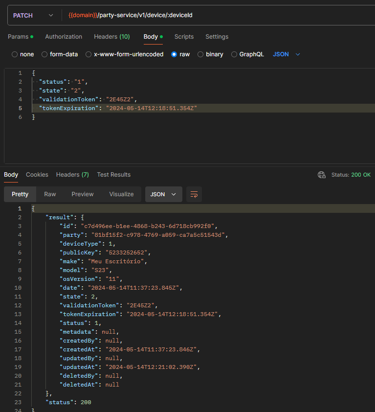
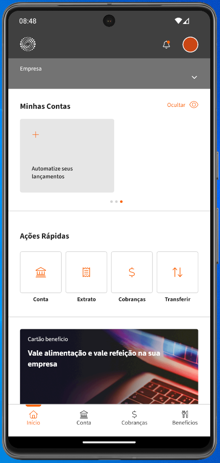

# Sprint 22s

### Patch Device - Party Service
Teste realizado na implementação que permite a atualização dos dados de Device. 
*Ref*.: [US_639704](https://dev.azure.com/tr-ggo/TR%20Fintech/_workitems/edit/639704)

### Listagem de empresas - Meu Escritório / Meu Negócio
Teste realizado na implementação do endpoit que visa listar as empresas acessiveis para o usuário. 
*Ref*.: [US_632633](https://dev.azure.com/tr-ggo/TR%20Fintech/_workitems/edit/632633) 
*Ref*.: [US_635996](https://dev.azure.com/tr-ggo/TR%20Fintech/_workitems/edit/635996)

.png)

### Resend token - Meu Escritório / Meu Negócio
Validada a implementação que implementou o endpoint de reenvio do token. 
*Ref*.: [US_637508](https://dev.azure.com/tr-ggo/TR%20Fintech/_workitems/edit/637508) 
*Ref*.: [US_637509](https://dev.azure.com/tr-ggo/TR%20Fintech/_workitems/edit/637509)

.png)

### Login no SuperApp
Teste realizado na tela de login do SuperApp conectando ao BE, permitindo o login tanto do 'Meu Escritório' e 'Meu Negócio' 
*Ref*.: [US_604004](https://dev.azure.com/tr-ggo/TR%20Fintech/_workitems/edit/604004)

### Testes Gerais iOS
Testes gerais no fluxo de criação de conta e login de forma a fazer uma avaliação geral do estado do SuperApp no iOS 
*Ref*.: [US_641644](https://dev.azure.com/tr-ggo/TR%20Fintech/_workitems/edit/641644)

### Card automação de lançamentos
Teste em relação a implementação do componente 'Automatize seus lançamentos' na home do SuperApp. 
*Ref*.: [US_635842](https://dev.azure.com/tr-ggo/TR%20Fintech/_workitems/edit/635842)

### Menu de + Mais ações
Testada a implementação do menu de '+ Mais ações'. 
*Ref*.: [US_635838](https://dev.azure.com/tr-ggo/TR%20Fintech/_workitems/edit/635838)

### Atualização Token JWT
Testada a implementação que visava trazer no token JWT as informações de PersonID e PartyID. 
*Ref*.: [US_641309](https://dev.azure.com/tr-ggo/TR%20Fintech/_workitems/edit/641309)