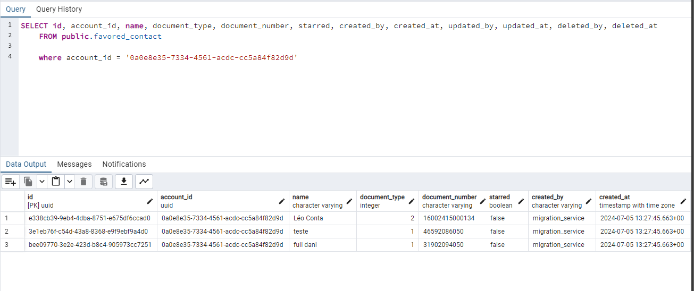
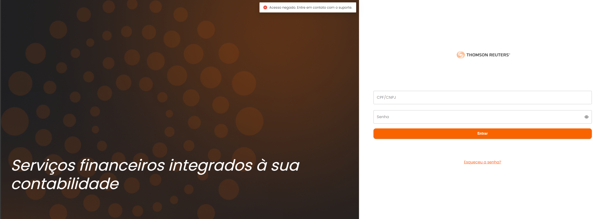
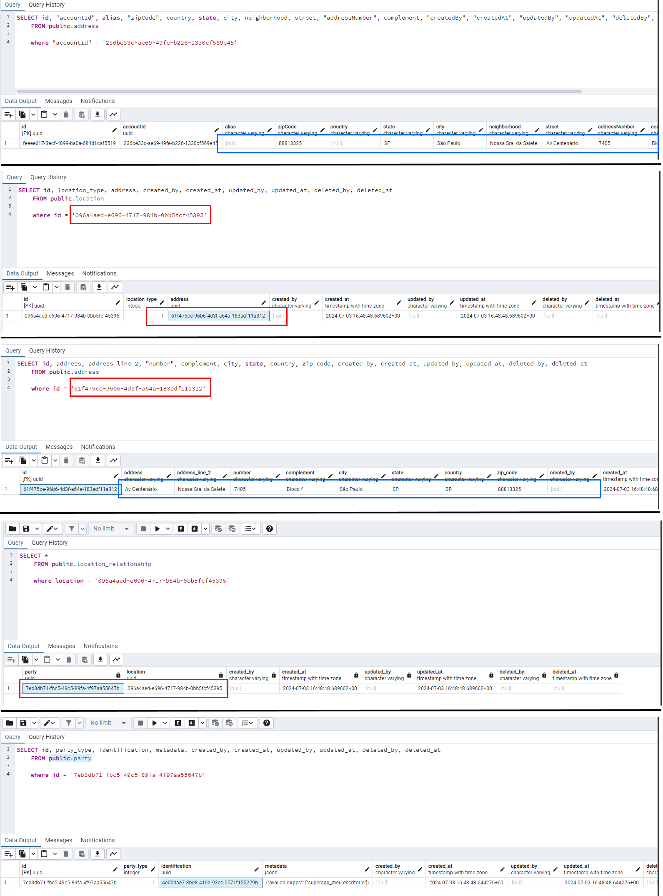

# Sprint 25s

## Migration Service
### Tabela favored-contact
Testes realizados no migration service na etapa que visa transferir os dados de contato favorecido, considerando apenas contatos com chave PIX igual a CPF/CNPJ

*Ref*.: [US_657546](https://dev.azure.com/tr-ggo/TR%20Fintech/_workitems/edit/657546)

### Desativar acesso ao ambiente legado
Testado o bloqueio de acesso ao ambiente legado no processo de migração.

*Ref*.: [US_645894](https://dev.azure.com/tr-ggo/TR%20Fintech/_workitems/edit/645894)

### Registro de Endereço
Testada a implementação que transfere os dados de endereço do ambiente legado para o superApp.

*Ref*.: [US_653270](https://dev.azure.com/tr-ggo/TR%20Fintech/_workitems/edit/653270)

## BFF
### Endpoint para verificação existência de PIN
Testada a implementação que visa conferir a existência ou não de PIN.

*Ref*.: [US_653324](https://dev.azure.com/tr-ggo/TR%20Fintech/_workitems/edit/653324)

### Endpoint para criação de PIN
Testada a implementação que visa a criação do PIN.

*Ref*.: [US_653329](https://dev.azure.com/tr-ggo/TR%20Fintech/_workitems/edit/653329)

### Endpoint para consulta das accounts a partir de uma party
Testada a implementação que permite consultar as accounts a partir de uma party

*Ref*.: [US_653265](https://dev.azure.com/tr-ggo/TR%20Fintech/_workitems/edit/653265)

## Account Service
### Endpoint para verificação existência de PIN
Testada a implementação que visa conferir a existência ou não de PIN.

*Ref*.: [US_653323](https://dev.azure.com/tr-ggo/TR%20Fintech/_workitems/edit/653323)

## Party Service
### Alteração na validação do endpoint /person
Foi testada a implementação que visa alterar as validações dos campos firstName, lastName e jobRole.

*Ref*.: [US_653268](https://dev.azure.com/tr-ggo/TR%20Fintech/_workitems/edit/653268)

## SuperApp
### Seleção de empresa não habilita botão 'Acessar'
Teste quanto a correção da ação do botão 'Acessar' na tela de seleção de empresas, que não habilitava mesmo embora estivesse selecionada.

*Ref*.: [US_652976](https://dev.azure.com/tr-ggo/TR%20Fintech/_workitems/edit/652976)

### Login e retorno para tela de login
Testada a implementação que visa corrigir o bug existente onde ao realizar o login e na tela de seleção de empresas retornar, onde o sistema voltava para a tela inicial de validação do CPF indevidamente.

*Ref*.: [US_652832](https://dev.azure.com/tr-ggo/TR%20Fintech/_workitems/edit/652832)

### Correção StatusBar
Validada a correção que visa a correção da Status Bar do device onde em alguns casos não havia alteração das cores, impossibilitando a visualização das informações do aparelho.

*Ref*.: [US_655591](https://dev.azure.com/tr-ggo/TR%20Fintech/_workitems/edit/655591)