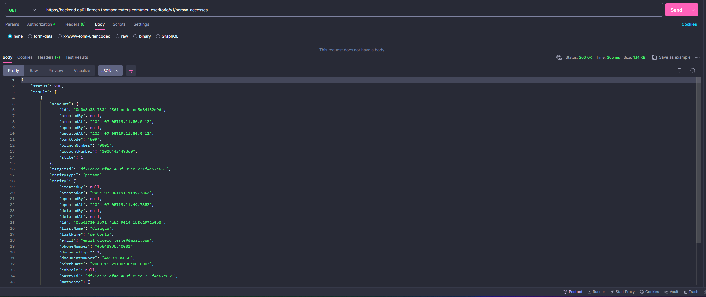
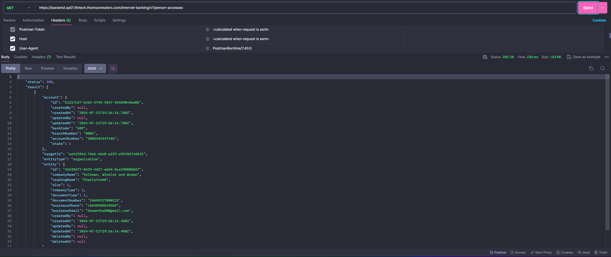

# Sprint 26s

## Migration Service
### Teste de migração de conta CNPJ
Testes realizados no migration service no fluxo completo de contas CNPJ

*Ref*.: [US_614706](https://dev.azure.com/tr-ggo/TR%20Fintech/_workitems/edit/614706)

## BUGs
### PIN vinculado à PartyId incorreta
Identificado e tratado o BUG em que estava sendo vinculado PIN ao partyId incorreto em contas CNPJ migradas.

*Ref*.: [US_661276](https://dev.azure.com/tr-ggo/TR%20Fintech/_workitems/edit/661276)

### Loading infinito ao criar PIN
Testado a correção do BUG em que fazia o usuário ficar em loading infinito após a criação do PIN.

*Ref*.: [US_660399](https://dev.azure.com/tr-ggo/TR%20Fintech/_workitems/edit/660399)

## SuperApp
### Desabilitar modo escuro
Teste da implementação que visava corrigir a possibilidade de alterar para o modo escuro no Android.

*Ref*.: [US_656539](https://dev.azure.com/tr-ggo/TR%20Fintech/_workitems/edit/656539)

## BFF - Meu Escritório
### Endpoint listagem de empresas e contas
Testada a implementação do endpoint que tem como finalidade listar as empresas e as contas bancárias vinculadas

*Ref*.: [US_658304](https://dev.azure.com/tr-ggo/TR%20Fintech/_workitems/edit/658304)

## BFF - IBK
### Endpoint listagem de empresas e contas
Testada a implementação do endpoint que tem como finalidade listar as empresas e as contas bancárias vinculadas

*Ref*.: [US_659064](https://dev.azure.com/tr-ggo/TR%20Fintech/_workitems/edit/659064)

